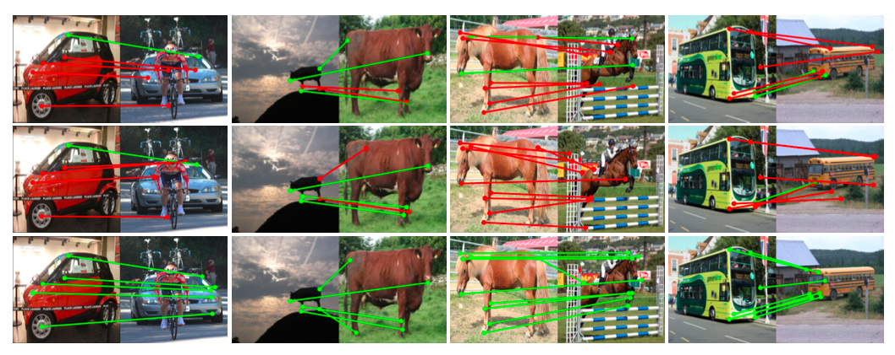
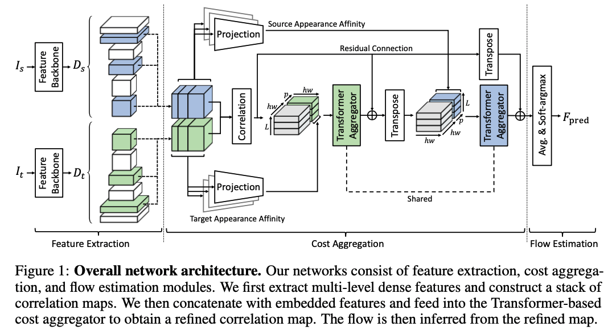
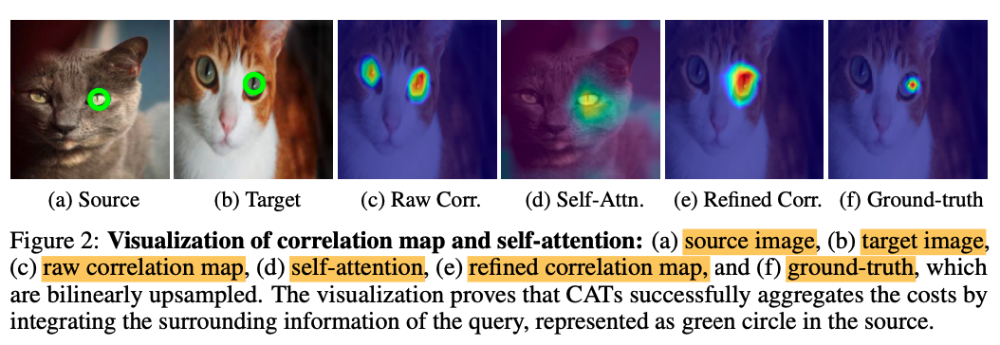
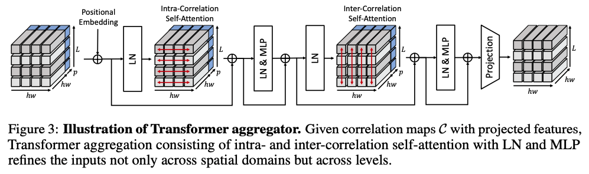
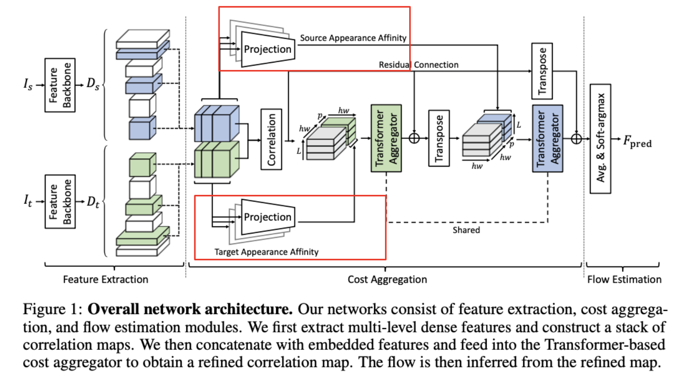
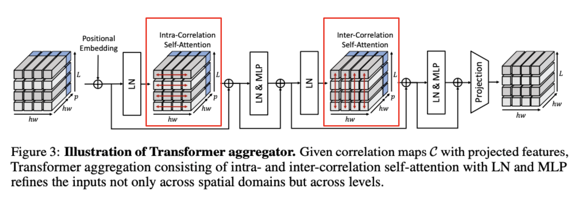
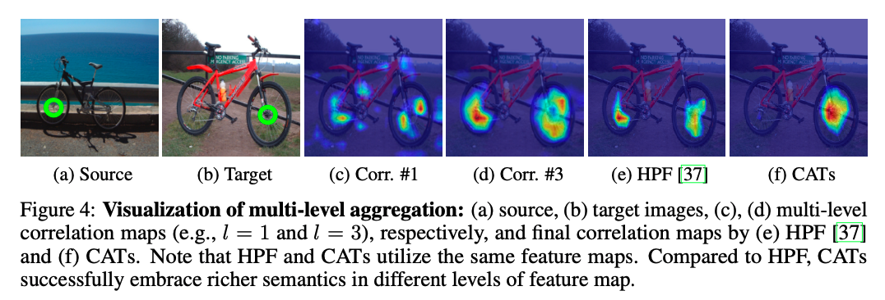
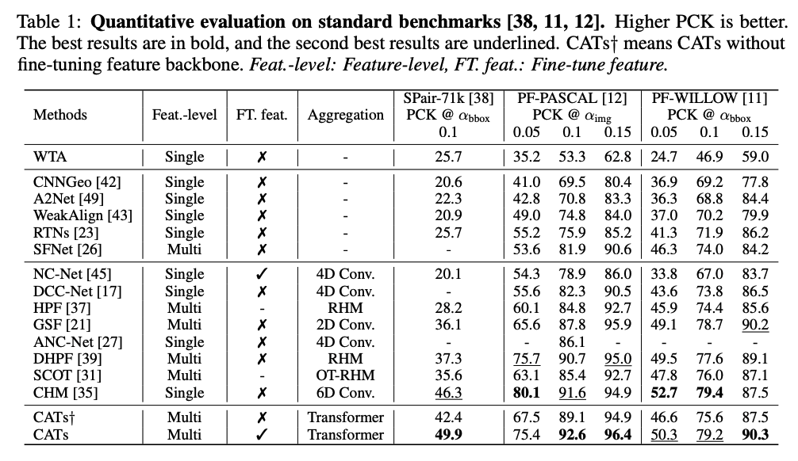
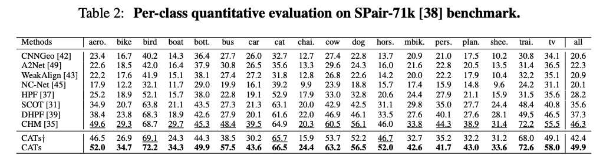
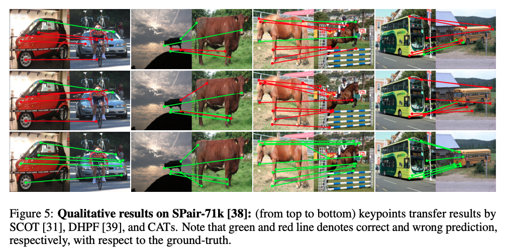

> # Introduction

|  | 
|:--:| 
| *[cutmix](https://arxiv.org/pdf/1905.04899.pdf)* |

Building **dense correspondences** between semantically similar images is useful for many computer vision applications such as semantic application, object detection, object video segmentation, and image editing. Classical dense correspondence mostly dealt with images captured under **similar geometrically constrained settings**, much simplifying the task. However, establishing semantic correspondences carry additional challenges from **large intra-class apperance** and **geometric variations**. In the above figure, each column consists of a pair of same object classes, but they're highly varying in terms of geometrical shape and appearances.

Recent approaches devised CNN-based models utilizing classical matching pipeline, feature extraction, cost aggregation, and flow estimation. Some works also focused on the **feature extraction stage** as more sophisticated and deep representations are highly likely to provide more useful information when corresponding two objects. However, **solely relying on the matching similarity between the extracted features without any prior** holds limitations posed by ambiguities generated by repetitive patterns or background clutters.

Meanwhile, some works  focused on the **flow estimation stage** by either applying additional CNN that predicts the parameters of a single global transformation(which is susceptible to large variations) or directly feeding the correlation maps into the decoder to predict dense correspondences. However, this approach requires good initial correlation maps.

**Cost Aggregation Transformers (CATs)** focus on the **cost aggregation stage** to tackle the previous issues. As **CATs** utilizes **Transformer** which inherently possesses **global receptive field**, it more effectively considers all the matching scores computed between the features of input images globally. Thus, CATs
seeks for **global consensus** (I like this term), refining the ambiguous or noisy matching scores.

> # Contributions

1. As shown in the left-most column in the above figure, there might be **discontinuities** in input images. To handle this, CATs **concatenates** an appearance embedding with the correlation map.

2. For **hierarchical feature representations**, CATs collect a **stack of correlation maps** from multi-level features

3. Utilizing **bidirectional nature of correlation map**, CATs explores the correlation map from both directions to get **reciprocal scores** by swapping the pair of dimensions of correlation map.

4. To make the learning easier, CATS use **residual connections** around aggregation networks

> # CATs Network Structure

|  | 
|:--:| 
| *[cutmix](https://arxiv.org/pdf/1905.04899.pdf)* |

> # CATs Overview

Here, we formulate the desired task with notations.

Denote a source and a target image as $I_s$ and $I_t$, respectively, which are semantically similar images.

The features extracted from $I_s$ and $I_t$ are denoted as $D_s$ and $D_t$, respectively.

The goal is to establish a **dense correspondence field** $F(i)$ between the images. The correspondence field is defined for **each pixel** $i$, which warps $I_t$ towards $I_s$

> # Feature Extraction and Cost Computation

|  | 
|:--:| 
| *[cutmix](https://arxiv.org/pdf/1905.04899.pdf)* |

CATs follow the common practice for feature extraction and cost computation.

CATs extracts **multi-level features** to construct more powerful correlation maps. CATs uses CNNs to produce a sequence of $L$ feature maps. Each feature map at $l^{th}$ level is denoted as $D_l$.

Once collected all the feature maps, we **resize** them to $\mathbb{R}^{h \times w \times c}$. Then, **L2 normalization** is applied to the resized feature maps.

We than compute a **correlation map** $\mathcal{C} \in \mathbb{R}^{hw \times hw}$ for resized dense features $D_s$ and $D_t$ using the inner product

$$\mathcal{C}(i ,j) = D_t(i) \cdot D_s(j)$$

where $i$ and $j$ denote the points in the target and the source features, respectively.

The computed correlation map contains all pairwise feature matches. However, it they're **raw** matching scores with numerous amgibuous matching points as shown in the above figure.

To solve this issue, the **cost aggregation networks** are proposed to refine the ambiguous or noisy matching scores.

> # Transformer Aggregator

|  | 
|:--:| 
| *[cutmix](https://arxiv.org/pdf/1905.04899.pdf)* |

The novel **Transformer** architecture is useful particularly for its **global receptive fields** achieved by **self-attention mechanism**. More details could be found in my [ViT post](https://noisrucer.github.io/paper/vit/). CATs laverages the Transformer architecture by intergrating the matching scores to find the **global consensus**.

Given the **raw cost** $\mathcal{C}$, we feed $\mathcal{C}$ to the **Transformer** $\mathcal{T}$ to obtain the **refined cost** $\mathcal{C}'$. The illustration of the refined cost can be found in figure $2-(e)$ in the above figure. The refined cost is formulated as,

$$\mathcal{C}' = \mathcal{T(\mathcal{C} + E_{pos})}$$

where $E_{pos}$ denotes **positional embedding**. The standard Transformer like ViT accepts 1D sequence of **token embeddings** (or image patches) as input. In CATs, we **reshape the correlation map** $\mathcal{C}$ **into a sequence of vectors**

$$\mathcal{C}(k) \in \mathbb{R}^{1 \times hw},\ \ k \in \{1, ..., hw\}$$

You can see the significant improvement compared to the raw correlation map in the figure above.

> # Appearance Affinity Modeling

|  | 
|:--:| 
| *[cutmix](https://arxiv.org/pdf/1905.04899.pdf)* |

If only the matching costs are considered for aggregation, the self-attention layer processes the correlation map itself even if there are noises involved in the correlation map, resulting in inaccurate crrespondences. To remedy this issue, CATs provides an additional **appearance embedding** from input features to disambiguate the correlation map aided by apperance affinity. The motivation behind this module is that **visual similar points** such as color have similar correspondences.

To provide appearance affinity, CATs **concatenates** **embedded features** projected from input features with the **correlation map**.

The features $D$ go through the linear projection networks and are concatenated with the correlation map. The correlation map is augmented such that

$$[\mathcal{C}, \mathcal{P}(D)] \in \mathbb{R}^{hw \times (hw + p)}$$

where $[\cdot]$ denotes concatenation and $\mathcal{P}$ denotes the linear projection network applied to $D$, and $p$ is the channel dimension of embedded feature.

The self-attention layer aggregates the correlation map and passes the output to the **linear projection neetworks** to retain the original dimension of $\mathcal{C}$ ($hw \times hw$).

> # Multi-Level Aggregation

|  | 
|:--:| 
| *[cutmix](https://arxiv.org/pdf/1905.04899.pdf)* |

As many works employ **multi-level features** to provide hierarchical semantic feature representations, CATs also uses multi-level features. The features collected from different convolutional layers are **stacked** to form the correlation maps. Each correlation map $C^l$ computed between $D_s^l$ and $D_t^l$ is **concatenated with corresponding embedded features** and fed into the aggregation networks. As a result, the aggregation networks gained fruitful information of multiple correlations.

As shown in the figure above, a **stack** of $L$ augmented correlation maps

$$[\mathcal{C}^l, \mathcal{P}(D^l)]_{i=1}^L \in \mathbb{R}^{hw \times (hw + p) \times L}$$

undergo the **Transformer aggregator**

## Intra-correlation self-attention

For **each** $l-th$ augmented correlation map, we aggregate with self-attention layer across **all the points** in the augmented correlation map. This methology is called **intra-correlation self-attention**.

## Inter-correlation self-attention

Opposite to the intra-correlation self-attention, the resulting correlation map from the intra-correlation undergoes the **inter-correlation self-attention** across multi-level dimensions.

Through these two different self-attention layers, CATs more effectively discovers multi-level matching scores, providing richer semantics.

## Visualization of Multi-level Aggregation

|  | 
|:--:| 
| *[cutmix](https://arxiv.org/pdf/1905.04899.pdf)* |

> # Cost Aggregation with Transformers

CATs propose the following additional techniques to enhance the performance.

## Swapping Self-Attention

Leveraging the **bidirectional matching scores** of the correlation map, CATs utilizes **reciprocal scores** to infer "confident" correspondences. In other words, not only calculating the matching scores, for example, from the source image perspective, CATs also does the same from the target image perspective (reciprocal scores).

To achieve this, we simply **transpose** the output (swapping the pair of dimensions) to concatenate with the embedded feature from the other image. Then, we feed into the next aggregator. During this process, the parameters of the Transformer aggregators are all **shared** to obtain reciprocal scores. This process is formulated as

$$\mathcal{S} = \mathcal{T}([\mathcal{C}^l, \mathcal{P}(D_t^l)]_{i=1}^L + E_{pos})$$

$$\mathcal{C}' = \mathcal{T}([(\mathcal{S^l})^T, \mathcal{P}(D_s^l)]_{i=1}^L + E_{pos})$$

where $\mathcal{C}^T(i,j) = \mathcal{C}(j,i)$ denotes **swapping**, $\mathcal{S}$ denotes the **intermediate correlation map before swapping the axis**.

## Residual Connection

Being a common practice in deep learning literature to make the learning process easier, **residual connection** is used in CATs. We enforce the cost aggregation networks to estimate the **residual correlation**.

> # Training

## Data Augmentation

Unlike CNNs which have strong **inductive biases** (assumptions for the unseen data), Transformer highly lacks inductive biases, requiring massive amount of data. Recent works have shown that data augmentation techniques resolve this issue to some degree. In this work, data augmentation techniques such as random cropping at 0.5 probability.

## Training Objective

The ground-truth keypoints are given for each pair of images. CATs first **averages** the stack of **refined correlation maps** $\mathcal{C}' \in \mathbb{R}^{hw \times hw \times L}$ to obtain $\mathcal{C}'' \in \mathbb{R}^{hw \times hw}$. Then, $\mathcal{C}''$ is transformed into a **dense flow field** $F_{pred}$ using soft-argmax operator. Finally, we compare the predicted dense flow field with the GT flow field $F_{GT}$.

We utilize **Average End-Point Error** (AEPE) for the training objective. AEPE is computed by averaging the Euclidean distance between the GT and the estimated flow.

$$\mathcal{L} = \lVert F_{GT} - F_{pred} \rVert_2$$

> # Experiments

|  | 
|:--:| 
| *[cutmix](https://arxiv.org/pdf/1905.04899.pdf)* |

|  | 
|:--:| 
| *[cutmix](https://arxiv.org/pdf/1905.04899.pdf)* |

|  | 
|:--:| 
| *[cutmix](https://arxiv.org/pdf/1905.04899.pdf)* |

> # References

[1] https://arxiv.org/pdf/2106.02520.pdf
