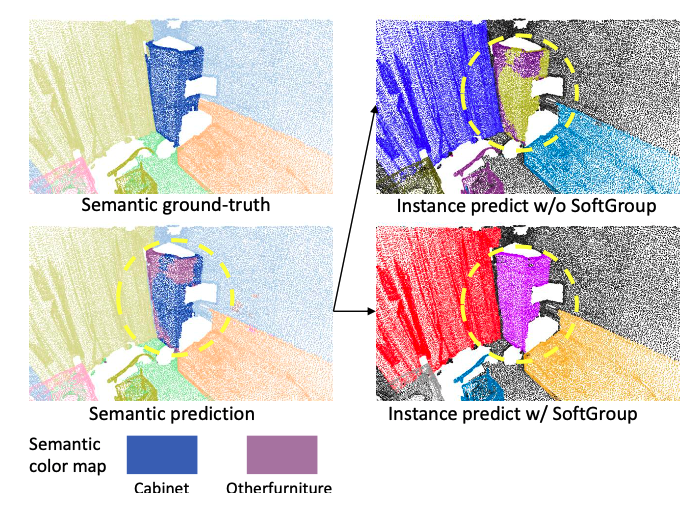
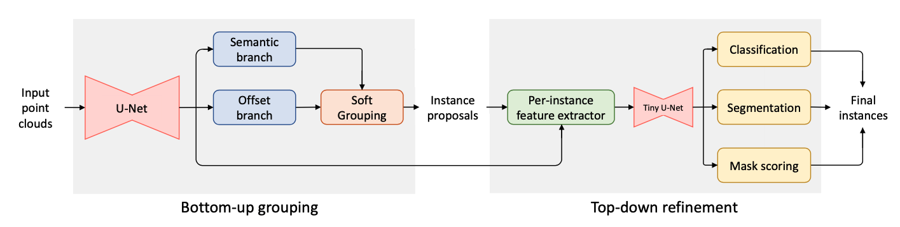
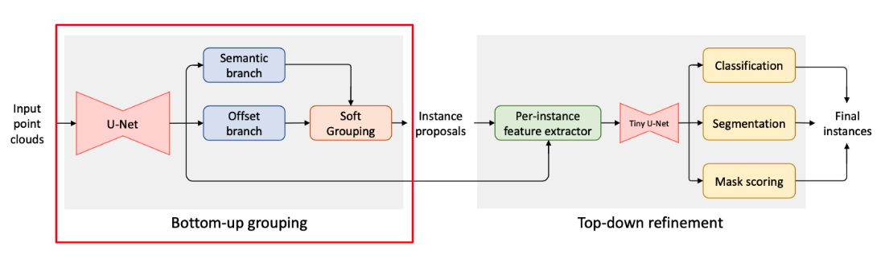
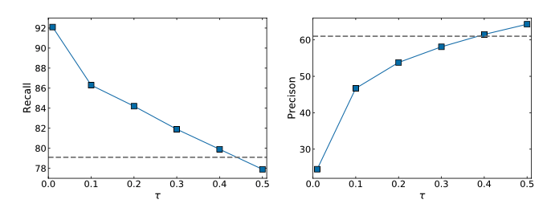
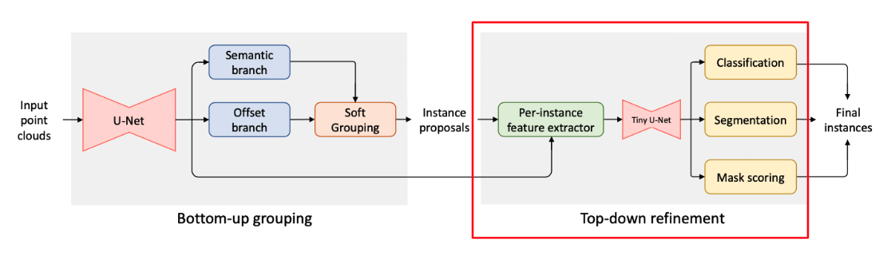
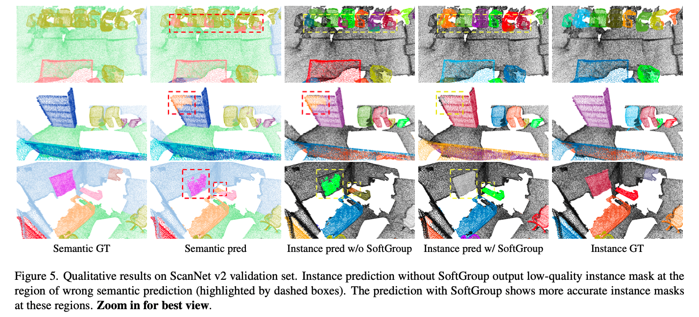
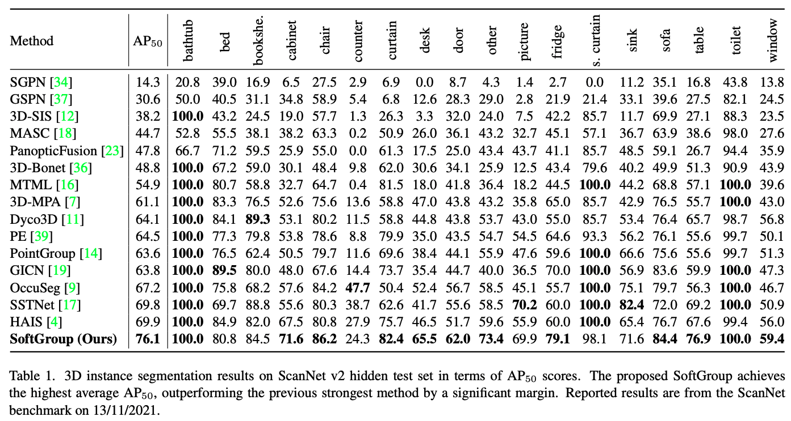
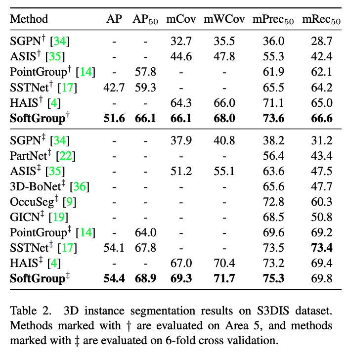
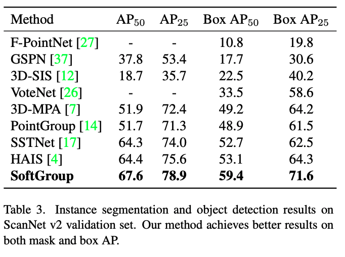

> # Introduction

|  | 
|:--:| 
| *[Cascade R-CNN](https://arxiv.org/abs/1712.00726)* |

Understanding of 3D data has become increasingly important especially due to its wide applications such as VR/AR, autonomous driving, and drone. Instance segmentation task accepts the **point clouds** data and predicts a **category** and an **instance mask** for each detected object. The current state-of-the-art methods approach the 3D instance segmentation task as a **bottom-up** approach. They learn the **point-wise semantic labels** and **center offset vectors**. Then, they **group** the points with the same label with small geometric distances into instances. These approaches are performed on the hard semantic prediction so that **each point** is associated with a single class. However, there are a few limitations to the hard semantic predictions. 

1. **Low overlap** between predicted instance and the GT

2. Many **false positives** from wrong semantic regions

These problems are shown in the above figure where the cabinat is predicted incorrectly as "other furniture". When hard semantic predictions are used for grouping, the semantic prediction error is **propagated** to instance prediction, resulting in the low overlap with the ground truth.

To address this issue, the paper proposed **SoftGroup** which considers **soft semantic scores** to perform grouping rather than hard one-hot semantic predictions. The essential intution is that the **object parts with incorrect semantic predictions still have "reasonable scores" for the true semantic class**. SoftGroup utilizes **score threshold** to determine the category to be assigned rather than the argmax values. Then, the instance with wrong semantic prediction is **suppressed** by learning to categorize it as **background** and the postive samples are refiend in top-down manner.

As a result, SoftGroup shows significant improvement of $+6.2%$ on the ScanNet test set and $+6.8%$ on S3DIS Area 5 by $AP_{50}$ metric.

> # SoftGroup

|  | 
|:--:| 
| *[Cascade R-CNN](https://arxiv.org/abs/1712.00726)* |

The above figure shows the overall flow of SoftGroup architecture which is divided into **two stages**

1. **Bottom-up grouping stage**: point-wise network predicts point-wise semantic labels and offset vectors

2. **Top-down refinement stage**: From the given proposals, the corresponding features from the backbone are extracted and used to predict classes, instance masks, and mask scores.

> # Bottom-up Point-wise Prediction Network

|  | 
|:--:| 
| *[Cascade R-CNN](https://arxiv.org/abs/1712.00726)* |

The point set input data data are **voxelized** to convert unordered points (coordinate and color) to **ordered volumetric grids**. Then, they're fed into a **U-Net** style backbone to extract point features. The **Submanifold Sparse Convolution** is used for the backbone. After obtaining the point features, **two branches** are designed to output the point-wise semantic scores and offset vectors.

## Semantic Branch

A semantic branch is constructed from a **two-layer MLP** to predict semantic scores $S$

$$S = \{ s_1,..,s_N \} \in \mathbb{R}^{N \times N_{class}}$$

where $N$ denotes the number of points and $N_{class}$ denotes the number of classes.

Then, we directly perform **grouping** on semantic scores unlike previous approaches that convert them to one-hot semantic predictions.

## Offset Branch

In parallel with the semantic branch, we also apply a **two-layer MLP** to learn the offset vectors $O$

$$O = \{ o_1,...,o_N \} \in \mathbb{R}^{N \times 3}$$

which denotes the vector from each point to the **geometric center** of the target instance the point belongs to.

Obtaining these learned offset vectors, we **shift** the points to the center of the corresponding instance to more effectively perform grouping.

## Loss function

For the semantic branch, the typical **cross-entropy loss** is used and $l_1$ **regression loss** is used for the offset branch.

$$L_{semantic} = \frac{1}{N} \sum_{i=1}^N CE(s_i, s_i^*)$$

$$L_{offset}=\frac{1}{\sum_{i=1}^N} \mathbb{1}_{\{p_i\}} \lVert o_i - o_i^* \rVert_1$$

where $s^*$ denotes the semantic label and $o^*$ denotes the offset label (vector from a point to the geometric center of the target instance). Lastly, $\mathbb{1}_{\{ p_i \}}$ is the identity or indicator function indicating whether the point $p_i$ belongs to **any** instance.

> # Soft Grouping

|  | 
|:--:| 
| *[Cascade R-CNN](https://arxiv.org/abs/1712.00726)* |

Until now, we obtained the semantic scores and offset vectors from the point-wise prediction network. It's time to predict **instance proposals**.

First, the given offset vectors are used to shift points to the **geometric center** of the corresponding instance. Then, we define a **score threshold** $\tau$ which is used to determine which class a point belongs to. Remember that we assign each point to **multiple classes** instead of picking one.

Given semantic scores $S$,

$$S \in \mathbb{R}^{N \times N_{class}}$$

we iterate through $N_{class}$ classes and at **each class index**, we slice a **point subset** of the "whole scene" which has the score higher than $\tau$. Since all points in each subset belong to the same class, we now traverse all the points in each subset to create the **links** between points with a geometric distance smaller than a **grouping bandwith** $b$ to finalize the instance proposals.

Unlike some existing proposal-based approaches which consider bounding boxes as object proposals, SoftGroup considers **point-level** proposals which are inherently more accurate and contain the scattered property of point clouds.

Since the quality of semantic segmentation highly affects the quality of instance proposals, the paper quantitatively explore the impact of varying $\tau$ on the **recall and precision**. The recall and precision for class $j$ are defined as,

$$recall_{j}=\sum_{i=1}^N \frac{(s_{ij} > \tau)\ \wedge \ (s_i^*. = j)}{s_i^* = j}$$

$$precision_{j}=\sum_{i=1}^N \frac{(s_{ij} > \tau)\ \wedge \ (s_i^*. = j)}{s_{ij} > j}$$

The above figure shows the recall and precision based on different $\tau$ thresholds compared with those of hard semantic prediction.

Using the score threshold, the recall increases as $\tau$ increases. However, the small score threshold leads to **low precision**. To mitigate this low precision problem, **top-down refinement stage** is proposed.

> # Top-down Refinement

|  | 
|:--:| 
| *[Cascade R-CNN](https://arxiv.org/abs/1712.00726)* |
From the bottom-up grouping stage we covered, the **top-down refinement stage** classifes and refines the given instance proposals. First, a **feature-extractor layer** processes each proposal to extract its corresponding backbone features. Then, the extracted features are fed into a **U-Net style network** (smaller version) before predicting classification scores, instance masks, and mask scores.

## Classification Branch

The classification branch first applies a global average pooling to sum up the feature of all points in the instance. Then, a MLP layer is applied to predice the classification scores $C$,

$$C = \{c_1,...,c_K\} \in \mathbb{K \times (N_{class} + 1)}$$

where $K$ is the number of instances. We directly predict the object category and confidence score from the classification branch.

## Segmentation Branch

As the instance proposals contain both foreground and background points, the segmentation branch, a point-wise MLP of two layers, predicts an instance mask $m_k$ within each proposal $k$.

## Mask Scoring Branch

The mask scoring branch resembles the classification branch design. The mask scoring branch outputs the **mask scores** $E$,

$$E = \{ e_1,...,e_K \} \in \mathbb{R}^{K \times N_{classs}}$$

which denote the **IoU** of a predicted mask with the GT.

Finally, the mask score is multiplied with the classification score to get the final confidence score.

## Learning Targets

Training the top-down refinement stage requires the target labels for each branch. We treat all instace proposals having IoU with a GT instance higher than $50%$ as positive samples and below as negatives. Every positive sample is assigned to a GT instance with the **highest IoU**. 

The classification target of a positive sample is the category of the corresponding GT instance.

The total number of classes also includes the **background class**: $N_{class} + 1$. The segmentation and mask scoring branches are only trained on positive samples.

The mask target of a positive sample is that of the assigned GT instance.

The mask score target is the IoU between the predicted mask and the GT mask.

The loss function used in these branches is the combination of **cross-entropy**, **binary cross-entropy**, and $l_2$ **regression losses**.

$$L_{class} = \frac{1}{K} \sum_{k=1}^K CE(c_k, c_k^*)$$

$$L_{mask} = \frac{1}{\sum_{k=1}^K \mathbb{1}_{\{m_k\}} \sum_{k=1}^K \mathbb{1}_{\{m_k\}} BCE(m_k, m_k^*)}$$

$$L_{mask\ score} = \frac{1}{\sum_{k=1}^K \mathbb{1}_{\{r_k\}} \sum_{k=1}^K \mathbb{1}_{\{r_k\}} \lVert r_k - r_k^* \rVert_2}$$

where $c^*, m^*, r^*$ denote the classification, segmentation, and mask scoring targets, respectively. $K$ denotes the total number of proposals and the indicator function $\mathbb{1}$ indicates whether the proposal is a positive sample or not.

> # Multi-task Learning

The whole network is trained **end-to-end** with a multi-task loss

$$L_{total} = L_{semantic} + L_{offset} + L_{class} + L_{mask} + L_{mask\ score}$$

> # Experiments

|  | 
|:--:| 
| *[Cascade R-CNN](https://arxiv.org/abs/1712.00726)* |

|  | 
|:--:| 
| *[Cascade R-CNN](https://arxiv.org/abs/1712.00726)* |

|  | 
|:--:| 
| *[Cascade R-CNN](https://arxiv.org/abs/1712.00726)* |

|  | 
|:--:| 
| *[Cascade R-CNN](https://arxiv.org/abs/1712.00726)* |

> # References

[1] [https://arxiv.org/pdf/2203.01509.pdf](https://arxiv.org/pdf/2203.01509.pdf)
